# Mixed Reality Wall Game with HoloLens 1

## 1 INTRODUCTION

Mixed reality is a new thing in the world of video games. It makes it easy to blend the real world with the virtual world. With Microsoft's HoloLens headset, you can create very cool and interactive gaming experiences. In this project, we use these features to make a game where the player's location becomes the game area.

This game turns the player's environment into a battlefield using technology that maps the space around them. The game's idea is to use a black hole as the center, where enemies come from. The player must fight different robots that attack in different ways and eliminate them with laser shots.

To develop this project, I used important technologies like Unity to create the game, Microsoft's Mixed Reality Toolkit to interact with the real world, and AI systems to manage the enemies. The idea was to make a game that’s easy to understand, where the lines between real and virtual disappear, offering a new way to have fun.

This report explains all the steps of creating and developing the project, from choosing technologies at the start to setting up game mechanics and AI systems, including problems faced and solutions found.
## 2 DEVELOPMENT ENVIRONMENT

### 2.1 Unity 2019.4 LTS
I used Unity as the main development tool. I chose version 2019.4 LTS because it is highly compatible with HoloLens 1. This version is recommended by Microsoft for creating applications for this HoloLens model [1].

### 2.2 Mixed Reality Toolkit (MRTK)
The Mixed Reality Toolkit (MRTK) is a set of tools developed by Microsoft to help create applications for HoloLens. With MRTK, I was able to scan the environment around the player using the Spatial Mapping Awareness feature. This allowed me to adapt the game to the player’s real space, using walls, the floor, and obstacles as game elements. Additionally, MRTK made it easy to connect the HoloLens headset to Unity, simplifying the creation and integration of game elements.

### 2.3 HoloLens Hardware (1st Generation)
HoloLens (1st Generation) is a wireless holographic computer. It creates 3D holograms around you using advanced sensors and optics.
Components of HoloLens:

Visor: Contains the sensors and displays.

Headband: For adjusting the headset.

Brightness and volume buttons: Located on the sides of the device.

Device arm: For putting on and removing the HoloLens.

Micro-USB cable: For charging the device or connecting it to a computer.

Power supply: To plug the HoloLens into a power outlet [2].

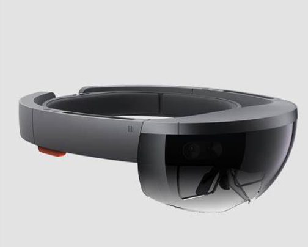

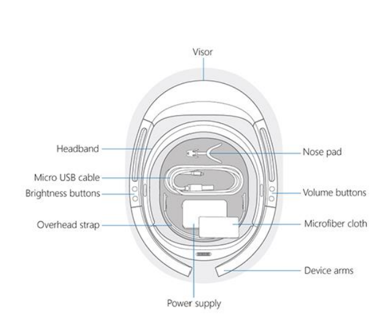

### 2.4 Spatial Mapping Setup
The HoloLens generates an accurate 3D mesh of the environment using a method based on infrared projections. A projector emits invisible infrared rays that spread throughout the room and bounce off surrounding surfaces, such as walls, furniture, and objects. Two cameras capture the return of these rays by analyzing their trajectory and return point. The HoloLens precisely calculates the distance and location of the impact points. These points are then connected to form a continuous spatial mesh, representing the geometry of the room in real-time. This mesh is constantly updated to allow optimal and dynamic positioning of holograms within the environment.

To implement environmental recognition in the game, I used the Spatial Awareness system from the Mixed Reality Toolkit (MRTK). To set up this system, I followed several essential configuration steps [7]:
First, I enabled the Spatial Awareness system in the MixedRealityToolkit, a key component for mixed reality. Then, I configured the Spatial Awareness System profile to meet my specific needs. Finally, I implemented the WindowsMixedRealitySpatialMeshObserver, which is specifically designed for HoloLens 1.
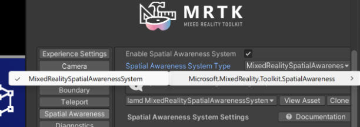

The spatial mesh setup was optimized based on three main aspects. I selected the level of detail to provide sufficient resolution for enemy navigation while maintaining good performance. The physical parameters were configured to handle collisions properly, including setting the appropriate physics layer. Lastly, I adjusted the display settings to ensure that the mesh was visible only during the development phase.
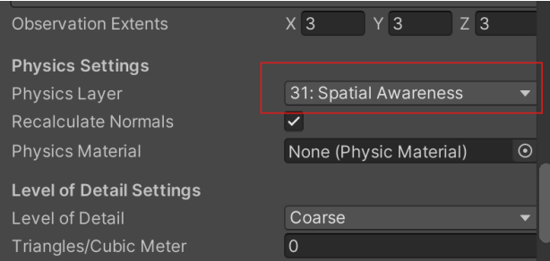

## 3 Game Design 
### 3.1. Scanning Process and Game Initialization
The scanning process is the first crucial step of the game. It utilizes the capabilities of the HoloLens to analyze the player's environment [3]. Here's how it works:
Initial Scan Phase:
When the game begins, the system automatically activates the HoloLens spatial mapping. A grid is formed in real-time, showing the surfaces detected within the room. The grid consists of blue, slightly transparent triangles, making it easy for the player to see the scanned areas.

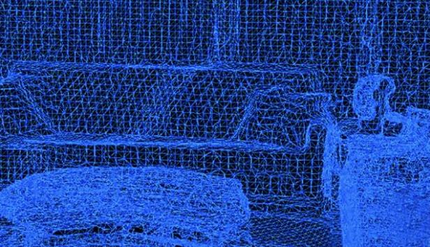
Selecting a Wall:
To make the experience more user-friendly during wall selection, I added interactive cursors to assist the player. There are two different cursors:

A green cursor appears when the player looks at a valid wall, with the text "Click here."

A red cursor appears when the player points at a surface that cannot be used (ceiling, floor, or non-flat surface), signaling to choose a wall.

This system allows the player to quickly know which surfaces can be used to start the game.

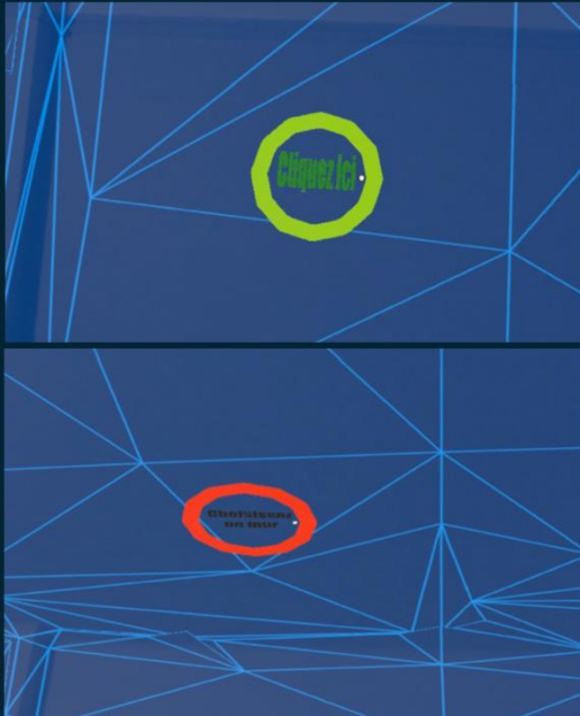

### 3.2. Laser Shooting System
The laser shooting system is based on the Toon Lasers asset from Hovl Studio [4], which I chose for its appealing visual style and compatibility with 3D rendering. Among the ten types of lasers offered, I selected the "Magic laser" due to its design, which perfectly matches the game's atmosphere.
The shooting is performed with an Air Tap gesture, which is easy to do with the HoloLens. The player simply raises their index finger in front of the headset as if preparing to shoot and then presses downward with the index to fire.

### 3.3. Enemy Design
In the game, I created three different types of enemy robots, each with its own way of attacking the player:

Robot Type 1: Head Attack
This robot is the simplest but also the most aggressive. It moves directly towards the player to strike with its head. It's an enemy that prefers being close to the player. It is fast and needs to be near to attack.

Robot Type 2: Simple Projectile Attack
This second robot prefers to stay at a distance. It shoots projectiles one by one towards the player. It doesn't need to be close to attack, but its shots are easier to avoid.

Robot Type 3: Multiple Projectile Attack
This is the most dangerous robot. It can fire several projectiles at once, making its attacks difficult to avoid. It stays far from the player and launches waves of projectiles. The attacks cover a larger area.

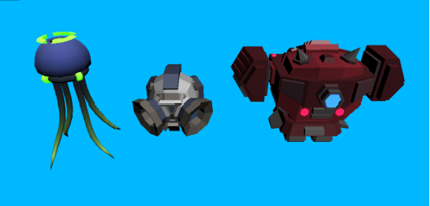
## 4 ARTIFICIAL INTELLIGENCE

### 4.1. Dynamic NavMesh System
NavMesh (Navigation Mesh) is like a special map that characters or objects use to move easily within a space. It shows where they can walk or not. It's commonly used in video games to help characters find their path [5].
The NavMesh system used in this game adapts automatically to the real-world environment that the HoloLens scans. This is important to provide a good mixed-reality experience, as each game space is different.

### 4.2. NavMesh Agent Configuration
For each robot, I configured specific movement parameters in Unity using the NavMesh Agent component. These parameters allow the robots to move realistically and adapt to their type. I defined a surrounding area for the robot to detect obstacles, its speed, its ability to accelerate and decelerate, its height, and the distance it needs to stop from its target. For example, the contact attack robot has a short stopping distance because it needs to approach the player, while the projectile-shooting robots maintain a greater distance. These settings are essential to create distinct and consistent behaviors for each enemy type [6].
The following figure shows the specific parameters configured in Unity for the contact attack robot, including:

A movement speed of 3.5 units

An obstacle avoidance radius of 0.5 units

A short stopping distance of 0.1 units, suitable for close combat

A height of 2 units for optimal navigation within the environment

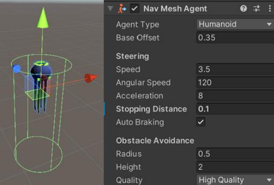

### 4.3. State Machine
To control the behavior of enemies, I used a state machine, which defines five states:
Appearance State:
The robot emerges from the black hole with an animation. This is the first state of every enemy when it enters the game. Once the appearance animation is complete, the robot automatically moves to the pursuit state.

Pursuit State:
The robot attempts to get closer to the player. It uses the NavMesh to find the best path and avoid obstacles. When it gets close enough to the player, it moves to the attack state.

Attack State:
In this state, each robot type has its own attack style:

The first robot attacks directly in close range.

The second robot shoots simple projectiles.

The third robot launches multiple projectiles at once.

Hit State:
When the robot is hit by the laser for the first time, it enters this state. For the second and third robots, they can endure a first laser hit and continue attacking.

Death State:
When the player's laser hits a robot, it enters the death state.

Disappearance State:
This is the robot's final state. It gradually disappears with visual effects, then is completely removed from the game.

These different states depend on the robot type.

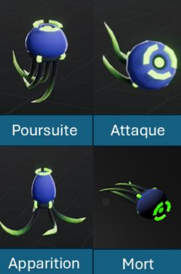

The following figures illustrate the different states of the attack robot, as well as the transition conditions between these states, particularly the distance conditions that trigger pursuit and attack behaviors.

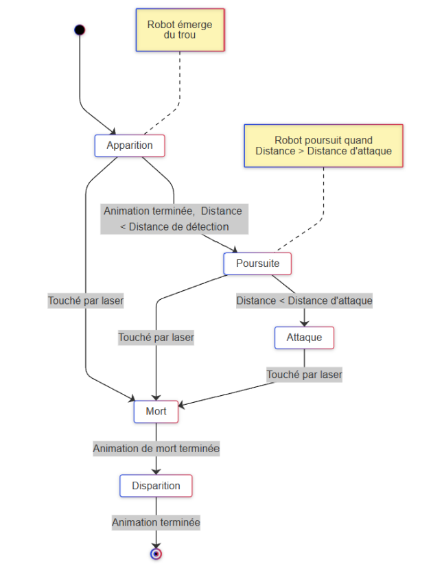
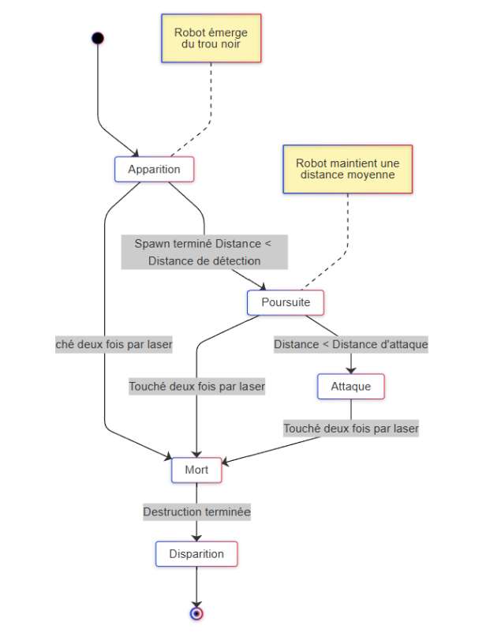
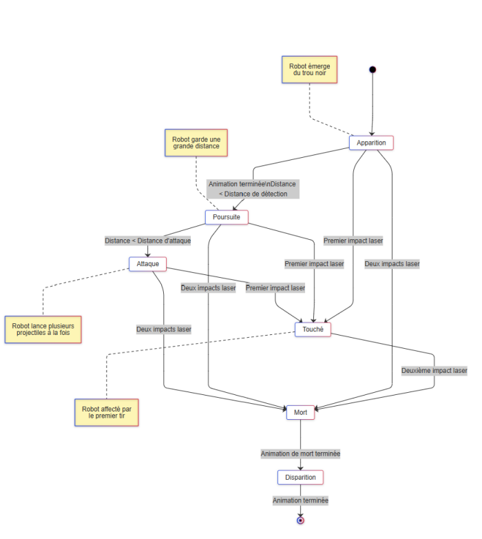

This way of managing enemies with "states" makes behaviors simpler and well-organized. It helps easily add new behaviors and respond well to the player's actions. Moreover, this approach makes code management easier since, if we want to modify an enemy's behavior, we only need to change the corresponding class for its state without modifying the rest of the code.

## 6 CONCLUSION

This game project for HoloLens 1 helped me learn about mixed reality and solve many technical problems. I made a game where players can attack enemy robots in their own environment.

Here’s what I did:

Created a combat system with a black hole as the main element.

Added three types of enemies with different behaviors.

Used spatial mapping to make the enemies move realistically.

Used HoloLens gestures for natural interactions.

Even with challenges like Unity compatibility, NavMesh limitations, and spatial mapping issues, this project shows that mixed reality has a lot of potential.

## 7 REFERENCES

- [1] Microsoft, "Porting HoloLens (1st Gen) apps to HoloLens 2", https://learn.microsoft.com/en-us/windows/mixed-reality/mrtk-unity/mrtk3-overview/.
- [2] Microsoft, "HoloLens (1st Gen) Hardware", https://learn.microsoft.com/fr-fr/hololens/hololens1-hardware.
- [3] Microsoft, "Spatial Mapping in Unity", Microsoft Mixed Reality Documentation.
- [4] Hovl Studio, "Toon Lasers", Unity Asset Store, 2023.
- [5] Unity, "Building a NavMesh", https://docs.unity3d.com/2020.1/Documentation/Manual/nav-BuildingNavMesh.html.
- [6] Unity Technologies, "NavMeshAgent Component", Unity Documentation, 2019.
- [7] Microsoft, "Spatial Recognition System", Mixed Reality Documentation, 2023.

 
